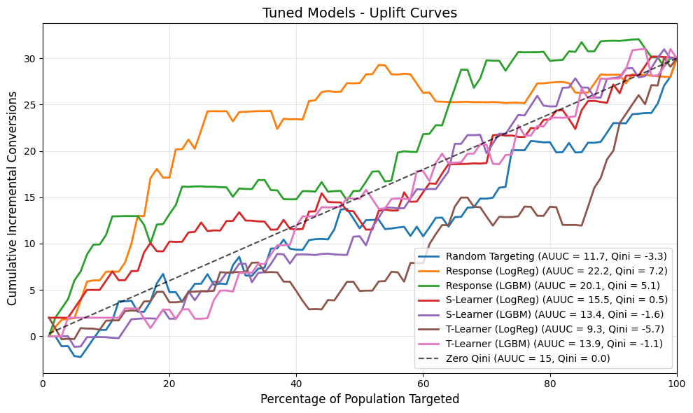

# Uplift Analysis of a Consumer Marketing Campaign

An analysis of S-Learner and T-Learner uplift models against response model and random targeting baselines on the Kevin Hillstrom MineThatData E-Mail Analytics and Data Mining Challenge dataset. Both Logistic Regression and LightGBM implementations are used for each model type, and the Qini coefficients are compared to determine which model provides the most uplift.

---

## Key Findings

- Response models outperformed uplift models on this dataset, achieving Qini coefficients of 7.23 (Logistic Regression) and 5.11 (LightGBM).
- Uplift models (S-Learner, T-Learner) performed near or below random baseline.
- Cross-validation revealed high variance in model performance, indicating that single train/test splits can give misleading results.
- These findings align with published research showing the Hillstrom dataset's size and imbalanced outcomes prevent uplift models from providing benefit over simpler approaches.

---

## Brief Summary of Results



The uplift curves show that response models consistently outperform uplift models across all population percentages. The S-Learner and T-Learner models perform near or below the random baseline, indicating they fail to identify treatment effect heterogeneity in this dataset.

---

## Repository Structure
```
├── src/
│   ├── data/
│   │   ├── raw/                        # Original Hillstrom dataset
│   │   └── processed/                  # Cleaned dataset for modeling
│   ├── images/                         # Figures for README
│   │   └── uplift_curves_tuned.png
│   ├── models/                         # Saved models and data splits
│   ├── notebooks/
│   │   ├── 01_eda.ipynb                # Exploratory data analysis
│   │   ├── 02_model_training.ipynb     # Baseline model implementation
│   │   └── 03_model_optimization.ipynb # Cross-validation and hyperparameter tuning
│   ├── evaluation_metrics/             # Custom uplift evaluation functions
│   │   ├── calculate_auuc.py
│   │   ├── calculate_qini.py
│   │   ├── calculate_uplift_curve.py
│   │   ├── display_uplift_metrics.py
│   │   ├── plot_uplift_curves.py
│   │   ├── print_classification_metrics.py
│   │   ├── print_response_model_stats.py
│   │   └── print_uplift_model_stats.py
│   └── optimization_methods/            # Cross-validation and tuning utilities
│       ├── cv_response_model.py
│       ├── cv_s_learner.py
│       ├── cv_t_learner.py
│       └── hyperparameter_search.py
├── requirements.txt
└── README.md
```

---

## Requirements

### Hardware

- **RAM**: 8GB minimum
- **CPU**: Any modern processor (no GPU required)
- **Storage**: ~500MB for data, notebooks, and saved models
- **Note**: Hyperparameter tuning in Notebook 03 may take 1-3 hours depending on processor speed

### Software

- Python 3.10 or higher
- Jupyter Notebook or JupyterLab

### Python Packages

Install dependencies using:
```bash
pip install -r requirements.txt
```

Or install manually:
```
pandas       >= 2.3.3
numpy        >= 2.4.1
scikit-learn >= 1.8.0
lightgbm     >= 4.6.0
matplotlib   >= 3.10.8
joblib       >= 1.5.3
```

---

## Instructions to Run

1. **Clone the repository**
```bash
   git clone git@github.com:zach-lloyd/uplift_marketing_optimization.git
   cd uplift_marketing_optimization
```

2. **Create a virtual environment (recommended)**
```bash
   python -m venv venv
   source venv/bin/activate  # On Windows: venv\Scripts\activate
```

3. **Install dependencies**
```bash
   pip install -r requirements.txt
```

4. **Launch Jupyter**
```bash
   jupyter notebook
```

5. **Run notebooks in order**
   - `01_eda.ipynb`                - Conducts exploratory data analysis
   - `02_model_training.ipynb`     - Implements baseline response and uplift models
   - `03_model_optimization.ipynb` - Performs cross-validation and hyperparameter tuning

   **Note**: Notebook 02 saves model artifacts to the `models/` directory that are required by Notebook 03. Run notebooks sequentially.

---

## Dataset

The Hillstrom MineThatData E-Mail Analytics Challenge dataset, found at: https://blog.minethatdata.com/2008/03/minethatdata-e-mail-analytics-and-data.html. 

This dataset contains 64,000 customers from a randomized email marketing experiment. This project uses the Men's E-Mail treatment group (21,307 customers) and control group (21,306 customers) to evaluate uplift modeling approaches.

---

## Areas for Future Improvement

- Implement Logistic Regression and LightGBM X-Learners and see if they fare any better than the S-Learners and T-Learners.

- Implement a demo interface that allows users to input customer features and receive a targeting recommendation.

- More extensive hyperparameter tuning for the LightGBM models (due to time constraints, I limited tuning of the LightGBM models to 100 iterations of a randomized search).

---

## References

- Alves, M. (2022). *21 - Meta Learners*. https://matheusfacure.github.io/python-causality-handbook/21-Meta-Learners.html#:~:text=might%20work%20better.-,Key%20Ideas,entire%20chapter%20dedicated%20to%20it.

- Hillstrom, K. (2008). *Kevin Hillstrom: MineThatData.* MineThatData. https://blog.minethatdata.com/2008/03/minethatdata-e-mail-analytics-and-data.html.

- Kunzel, S., et. al. (2019). *Meta-learners for Estimating Heterogeneous Treatment Effects using Machine Learning*. https://arxiv.org/pdf/1706.03461.

- Nyberg, O. (2023). *Exploring uplift modeling with high class imbalance*. Data Mining and Knowledge Discovery. https://link.springer.com/article/10.1007/s10618-023-00917-9.

- Proppe, D. (2017). *Uplift modelling is hard — but worth it*. Medium. https://medium.com/touchpoints-ai/uplift-modelling-is-hard-but-worth-it-37a9e9dc5015.

- Saha, S. (2025). *XGBoost vs LightGBM: How Are They Different*. Neptune Labs. https://neptune.ai/blog/xgboost-vs-lightgbm#:~:text=Structural%20differences%20between%20XGBoost%20and,utilization%20of%20two%20novel%20techniques:.

- Xu, Y. (2024). *How does LightGBM Handle Categorical Features with High Cardinality*. https://medium.com/@YanAIx/how-does-lightgbm-handle-categorical-features-with-high-cardinality-381fb06e7cc1.


